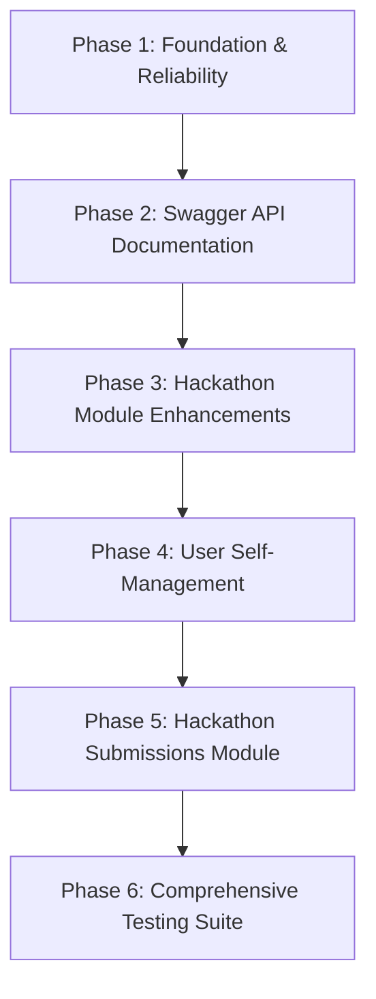

# Detailed Feature Implementation Roadmap & Phases

This document outlines the step-by-step phases to build out remaining feature gaps, production reliability, API documentation, and test suites for the **Hackathon Backend** project.

---

## 🗺️ Roadmap Architecture



---

## Phase 1: Foundation & Reliability (Filters & Health Checks)

### Goal
Standardize API exception responses across all endpoints to match `ResponseInterceptor` formatting and provide production health monitoring.

### Tasks
1. **Global Exception Filter**:
   - Create `src/common/filters/http-exception.filter.ts`.
   - Intercept all `HttpException` and uncaught exceptions.
   - Format standard error output:
     ```json
     {
       "success": false,
       "message": "Error message",
       "errors": [],
       "statusCode": 400,
       "timestamp": "2026-08-02T08:15:00.000Z"
     }
     ```
2. **Global Registration**:
   - Register filter in `src/main.ts` using `app.useGlobalFilters()`.
3. **Health Check Module**:
   - Install `@nestjs/terminus`.
   - Implement `src/module/health/health.module.ts` and `src/module/health/health.controller.ts`.
   - Expose `GET /health` checking PostgreSQL / Prisma connection status.

---

## Phase 2: Developer Experience & API Documentation (Swagger)

### Goal
Provide interactive OpenAPI/Swagger documentation UI for easy API testing and frontend integration.

### Tasks
1. **Dependencies**:
   - Add `@nestjs/swagger` and `swagger-ui-express` to `package.json`.
2. **Swagger Setup in `src/main.ts`**:
   - Configure `DocumentBuilder` with app title, version, and auth schemas (Bearer/Cookie).
   - Mount UI at `/docs`.
3. **DTO & Controller Decorators**:
   - Decorate Hackathon DTOs (`create-hackathon.dto.ts`, `update-hackathon.dto.ts`) and controllers (`hackathon.controller.ts`, `user.controller.ts`) with `@ApiTags()`, `@ApiOperation()`, `@ApiResponse()`, and `@ApiProperty()`.

---

## Phase 3: Hackathon Module Enhancements

### Goal
Upgrade hackathon functionality with pagination, keyword search, unjoining capability, and participant listings.

### Tasks
1. **Query DTO**:
   - Create `src/module/hackathon/dto/query-hackathon.dto.ts` with `page`, `limit`, `status` (`active` | `upcoming` | `ended`), and `q` (search query).
2. **Service Methods (`src/module/hackathon/hackathon.service.ts`)**:
   - Update `findAll()` to support pagination metadata `{ items, total, page, limit, totalPages }` and search filters.
   - Implement `unjoin(hackathonId, userId)` to delete participant record.
   - Implement `getParticipants(hackathonId)` to fetch participant profiles.
3. **Controller Endpoints (`src/module/hackathon/hackathon.controller.ts`)**:
   - `GET /hackathon` -> accept `@Query() queryDto: QueryHackathonDto`.
   - `DELETE /hackathon/:id/leave` -> allow participant to leave a hackathon.
   - `GET /hackathon/:id/participants` -> fetch participant list.

---

## Phase 4: User Profile & Self-Management

### Goal
Allow authenticated users to view their profile, update their details, and view their hackathon involvement.

### Tasks
1. **Service Methods (`src/module/user/user.service.ts`)**:
   - `getProfile(userId)`: returns user profile details along with joined hackathons.
   - `updateProfile(userId, updateDto)`: update `name`, `image`.
   - `getUserHackathons(userId)`: list hackathons created or joined by the user.
2. **Controller Endpoints (`src/module/user/user.controller.ts`)**:
   - `GET /user/me` -> retrieve current user profile.
   - `PATCH /user/me` -> update profile details.
   - `GET /user/me/hackathons` -> list user's joined/created hackathons.

---

## Phase 5: Submissions Module (Core Domain Feature)

### Goal
Enable participants to submit project entries (repository link, live demo, description) for hackathons they have joined.

### Tasks
1. **Prisma Schema Update (`prisma/schema.prisma`)**:
   - Remove unused placeholder `Post` model.
   - Add `Submission` model:
     ```prisma
     model Submission {
       id           String    @id @default(cuid())
       title        String
       description  String
       repoUrl      String
       demoUrl      String?
       hackathonId  String
       userId       String
       hackathon    Hackathon @relation(fields: [hackathonId], references: [id], onDelete: Cascade)
       user         User      @relation(fields: [userId], references: [id], onDelete: Cascade)
       createdAt    DateTime  @default(now())
       updatedAt    DateTime  @updatedAt

       @@unique([hackathonId, userId])
       @@index([hackathonId])
     }
     ```
2. **Database Migration**:
   - Run `npx prisma migrate dev --name add_submission_model`.
3. **Submission Module (`src/module/submission/`)**:
   - Create `submission.module.ts`, `submission.service.ts`, `submission.controller.ts`, and DTOs.
   - Validation rules:
     - User must be a participant of the hackathon.
     - Hackathon must be active.
     - Unique constraint: One submission per participant per hackathon.
   - Endpoints:
     - `POST /hackathon/:id/submission` (Create submission)
     - `GET /hackathon/:id/submissions` (List all submissions for a hackathon)
     - `GET /submission/:id` (Get submission details)
     - `DELETE /submission/:id` (Delete submission)

---

## Phase 6: Automated Test Suite (Unit & E2E)

### Goal
Provide unit tests for core services/controllers and E2E integration tests for endpoints.

### Tasks
1. **Unit Tests (`src/**/*.spec.ts`)**:
   - `src/module/hackathon/hackathon.service.spec.ts`
   - `src/module/user/user.service.spec.ts`
   - `src/module/submission/submission.service.spec.ts`
2. **E2E Integration Tests (`test/**/*.e2e-spec.ts`)**:
   - `test/hackathon.e2e-spec.ts`
   - `test/user.e2e-spec.ts`
   - `test/submission.e2e-spec.ts`

---

## 🛠️ How to Execute

To start implementing, follow the phases sequentially. You can instruct the AI assistant:
> "Let me begin with Phase 1: Global Exception Filter and Health Check Endpoint."
